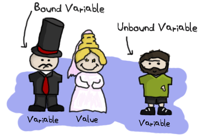
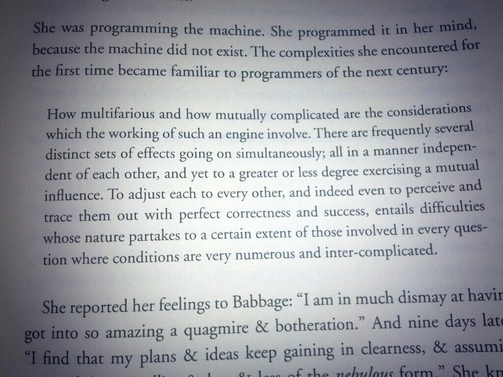
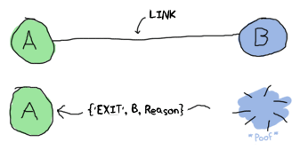

!SLIDE
# Let it Crash #
## Tristan Sloughter ##

!SLIDE bullets
# Credits Already?? #

* This OTP Life (http://thisotplife.tumblr.com/)
* Learn You Some Erlang (http://learnyousomeerlang.com/)

!SLIDE bullets
# Handles! #

* Github: tsloughter
* Twitter: @t_sloughter
* Email: tristan@heroku.com

!SLIDE bullets
# Who Am I? #

* Heroku routing infastructure engineer
* HTTP Request Routing
* Logging (github.com/heroku/logplex)

!SLIDE bullets
# Who Are You? #

* Engineers
* Novice or no Erlang experience

!SLIDE bullets
# Outline #

* Erlang
* Fault Tolerance
* It's OK to Crash?
* Unique Erlang Characteristics
* OTP

!SLIDE center
# Real World? #

!SLIDE bullets
# History #

* Ericsson looking for best language for telecom systems
* Concurrency and error recovery at top of the list
* Lisp, Prolog, Parlog considered, but ruled out
* Joe creates Erlang in 1986, language with concurrency and error recovery built in
* Joe's thesis mentions 9 9's for AXD301

!SLIDE bullets
# Erlang's Focused on Features #

* Concurrency
* Distribution
* Actors
* Green Threads

!SLIDE center
# Without Error Recovery #

!SLIDE center
# Fault Tolerance Compared#

Erlang 
Copycats 

!SLIDE bullets
# Fault Tolerance in Routing #

* Many components can go wrong (bad request, bad response, missing dyno, missing records, overloaded, ...)
* Degradation better than no response

!SLIDE bullets
# Fault Tolerance in Logging #

* Similar to routing issues
* Better delayed than lost
* Better some than none
* And better to inform of missing logs then them simply not be there

!SLIDE bullets
# What is Fault Tolerance? #

Ability to keep working to a level of satisfaction in the presence of failure

!SLIDE bullets
# Isolation #

!SLIDE bullets
# Graceful Degradation #

!SLIDE bullets
# What is Let It Crash? #

!SLIDE bullets
# Why it Matters #

* You'll never test every scenario (though QuickCheck/PropEr help)
* You don't want your system to go down!
* Defensive coding sucks
* Prepares you for the quick recovery from the unexpected
* And most important...

!SLIDE center
# It Will Catch on Fire! #

!SLIDE bullets
# What's a Crash? #

* A process crash
* No longer exists, all state lost

!SLIDE bullets
# Erlang's Best Unknown Feature #

* Language comparisons to Erlang leave it out (except Akka)
* Can't be duplicated on existing VMs
* But why?

!SLIDE bullets
# Erlang Isolation #

* Immutable
* Cheap process spawning
* Message passing
* Process monitoring and linking

!SLIDE bullets
# Immutable #

!SLIDE bullets
# Ada Lovelace #

!SLIDE bullets
# Message Passing #

* No Shared State

!SLIDE bullets
# Lightweight Processes #

* Key to isolation, message passing and supervising

!SLIDE bullets
# Monitor #

* Unidirectional

!SLIDE bullets
# Link #

* Bidirectional

!SLIDE center
#Link #

!SLIDE code
# Trap Exit #

    @@@ Erlang
    process_flag(trap_exit, true),
    ...
    receive
      {'EXIT', Pid, ...} ->
          ...
    end

!SLIDE bullets
# Erlang Graceful Degradation #

* Cheap process spawning
* Preemptive scheduling
* Garbage collection

!SLIDE bullets
# Garbage Collection #

* Per process
* Heap per process
* Concurrent

!SLIDE center
# Modify and Inspect Live System  #

!SLIDE bullets
# Erlang Middleware #

* OTP: gen_server, supervisors, etc.

!SLIDE bullets
# OTP: The J2EE of Erlang?

!SLIDE bullets
# Server Common Pattern #

!SLIDE bullets
# Supervisors #

!SLIDE center
# One for All #

!SLIDE center
# One for One #

!SLIDE center
# Rest for One #

!SLIDE bullets
# Init State #

* All process state is lost on crash
* Safe state to restart from
* Able to start accepting messages again from a error-free state

!SLIDE bullets
# Pull it All Together #

* Increased efficiency in writing scalable/fault-tolerant systems
* Non-defensive means shorter code: faster to develop, less bugs, easier to maintain
* But it won't do it for you

!SLIDE bullets
# Back to Industry #

* Ericsson
* Heroku
* Boundary
* Basho
* Amazon
* Facebook

!SLIDE bullets
# References #

* LYSE : http://learnyousomeerlang.com/
* OTP in Action: http://www.manning.com/logan/
* Erlang Central : http://erlangcentral.org/
